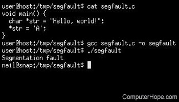

# Description

We can get a segmentation fault if we press the ESC button 10'000 times within 3.8 seconds

This is what the screen looks like:

I've also attached the log file: [log file](attachments/file.log)

# Repro Steps

- Press ESC button 10'000 times, but you need to be fast <= 3.8 sec
- Check the screen hehe

# Expected Behavior

Well, memory safty would be nice. Maybe look into using Rust? ;)

# System Info

LCD driver v1.0.3
